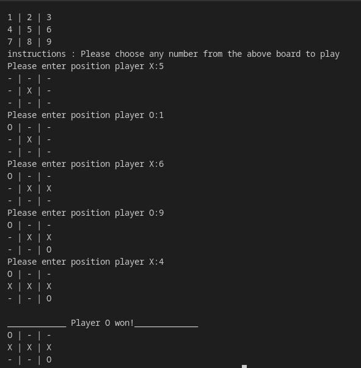

## 🧠 Tic-Tac-Toe (CLI Version)

A simple terminal-based **Tic-Tac-Toe** game built in Python for two players.


---

### 🎮 How to Play

* The game board shows positions **1–9**.
* Each player takes turns entering a number to place their mark (`X` or `O`).
* First player to get 3 in a row **(horizontally, vertically, or diagonally)** wins!
* If all spaces are filled with no winner, the game ends in a draw.

---

### ▶️ How to Run

```bash
git clone https://github.com/godfreydekew/tictactoe_game.git
cd tictactoe_game
python3 tictactoe.py
```


